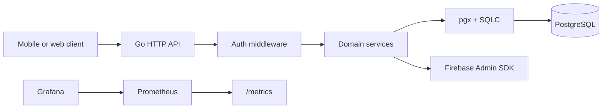

# Delta

Delta is a Go backend for employee attendance, outlet memberships, geofenced clock-in/out, and salary reporting.

It provides a versioned HTTP API under `/api/v1`, PostgreSQL persistence, Firebase ID-token verification, local JWT access and refresh tokens, Prometheus metrics, Swagger UI, and Excel salary exports.

## Architecture



Handlers are intentionally thin. Domain behavior lives in services, persistence is isolated in `db`, and SQL is generated from the hand-written queries in `db/queries`.

## Features

- Firebase ID-token login with local JWT access and refresh tokens
- Refresh-token rotation, revocation, logout, and account deletion
- Outlet creation, updates, soft deletion, and owner-controlled memberships
- Employee invitations, acceptance, rejection, leaving, removal, and display names
- Employee and owner-managed attendance entries
- Outlet geofencing with haversine distance checks
- Exact decimal handling for coordinates, hours, and salary calculations
- Timezone-aware daily salary reports with Excel export
- In-memory fixed-window rate limiting for authentication and write-heavy routes
- Prometheus business, HTTP, runtime, process, and database-pool metrics
- Embedded OpenAPI specification and Swagger UI

## Quick Start

### Requirements

- Go 1.25+
- PostgreSQL 17+ or Docker/Podman
- `make`
- Firebase service-account JSON for real Firebase login flows

### Run Locally

```bash
cp .env.example .env
# Set JWT_SECRET and Firebase settings in .env.
make run
```

With `AUTO_MIGRATE=true`, the service applies embedded migrations on startup.

### Run With Compose

```bash
cp .env.example .env
# Place firebase/service-account.json for real Firebase authentication.
docker compose up --build
```

The app is available at `http://localhost:8080`.

## Configuration

| Variable | Default | Description |
| --- | --- | --- |
| `PORT` | `8080` | HTTP listen port |
| `DATABASE_URL` | local PostgreSQL URL | PostgreSQL connection URL |
| `AUTO_MIGRATE` | `true` | Apply migrations during startup |
| `JWT_SECRET` | required | Secret used to sign local tokens |
| `JWT_ACCESS_TOKEN_TTL` | `900000` | Access-token lifetime in milliseconds |
| `JWT_REFRESH_TOKEN_TTL` | `2592000000` | Refresh-token lifetime in milliseconds |
| `JWT_REFRESH_CLEANUP_INTERVAL` | `86400000` | Refresh-token cleanup interval in milliseconds |
| `JWT_REFRESH_REVOKED_RETENTION` | `604800000` | Revoked-token retention in milliseconds |
| `FIREBASE_SERVICE_ACCOUNT_PATH` | `firebase/service-account.json` | Firebase service-account file |
| `PROMETHEUS_BEARER_TOKEN` | empty | Optional bearer token for `/metrics` |
| `TRUST_PROXY_HEADERS` | `true` | Trust forwarded client-IP headers |
| `LOG_LEVEL` | `info` | Log level |
| `LOG_FORMAT` | `text` | `text` or `json` |

See `.env.example` for a complete local configuration.

## API And Operations

| Endpoint | Purpose | Authentication |
| --- | --- | --- |
| `GET /healthz` | Liveness check | Public |
| `GET /readyz` | Database readiness check | Public |
| `GET /metrics` | Prometheus metrics | Bearer token when configured |
| `GET /docs/` | Swagger UI | Public |
| `GET /docs/openapi.yaml` | OpenAPI 3 specification | Public |
| `/api/v1/auth/*` | Login and token lifecycle | See OpenAPI spec |
| `/api/v1/outlets/*` | Outlet, membership, attendance, and report APIs | Mostly protected |

The OpenAPI document is the API contract. Browse it at `/docs/openapi.yaml` or use the interactive UI at `/docs/`.

## Development

```bash
make build       # Build cmd/delta
make test        # Run all tests
make lint        # Run go vet and gofmt check
make vet         # Run go vet
make fmt         # Format Go sources
make run         # Run the API locally
```

After editing a SQL query:

```bash
cd db && sqlc generate
```

Do not edit SQLC-generated files directly. Add schema changes as a new migration in `db/migrations`.

## Testing

The suite includes:

- Unit tests for decimal arithmetic, validation, geofencing, pagination, and middleware
- Service integration tests against PostgreSQL
- HTTP contract tests covering authentication, authorization, response shapes, and error behavior
- Excel export tests

Run the full suite:

```bash
make test
```

Integration tests use Testcontainers. Docker or rootless Podman is required to run them instead of skipping them. For rootless Podman:

```bash
export DOCKER_HOST=unix:///run/user/$(id -u)/podman/podman.sock
export TESTCONTAINERS_RYUK_DISABLED=true
make test
```

## Observability

The Prometheus registry exposes:

- HTTP request totals and duration histograms
- Authentication, outlet, membership, attendance, report, and account counters
- Go runtime and process metrics
- PostgreSQL pool totals and idle connections

Grafana provisioning is under `monitoring/grafana`. The dashboard is designed around the Go metric names and reloads from disk periodically.

For local load testing:

```bash
./loadtest/seed.sh
docker run --rm -i -e BASE_URL=http://localhost:8080 grafana/k6 run - < loadtest/smoke.js
docker run --rm -i -e BASE_URL=http://localhost:8080 grafana/k6 run - < loadtest/capacity.js
docker run --rm -i -e BASE_URL=http://localhost:8080 grafana/k6 run - < loadtest/rate-limit.js
```

The load tests mint local JWTs using the configured `JWT_SECRET`; Firebase credentials are not required for them.

## Project Layout

```text
cmd/delta/      Application entrypoint and dependency wiring
config/         Environment configuration
db/             PostgreSQL pool, migrations, SQLC models and queries
httpapi/        Router, middleware, pagination, errors, docs, rate limiting
auth/           Firebase, JWT, refresh tokens, auth handlers
user/           Account deletion
outlet/         Outlets and memberships
attendance/     Attendance entries and geofencing
report/         Salary reports and Excel export
decimal/        Exact arbitrary-precision decimal values
audit/          Best-effort business audit events
metrics/        Prometheus registry and instrumentation
contract/       HTTP contract and database integration tests
monitoring/     Prometheus and Grafana configuration
loadtest/       k6 scripts and deterministic seed data
```

More detail is available in [`STRUCTURE.md`](STRUCTURE.md). Setup and deployment instructions are in [`SETUP.md`](SETUP.md), and repository conventions are documented in [`AGENTS.md`](AGENTS.md).

## Security Notes

- Keep `JWT_SECRET`, Firebase credentials, Prometheus tokens, and database credentials out of Git.
- Set `TRUST_PROXY_HEADERS=true` only when a trusted proxy overwrites forwarded headers.
- Keep `/metrics` private to monitoring infrastructure.
- Account deletion is blocked while the user owns active outlets; delete or transfer those outlets first.
- Outlets, memberships, and attendance use soft-deletion rules where historical reporting requires preservation.

## License

No license has been declared yet.
